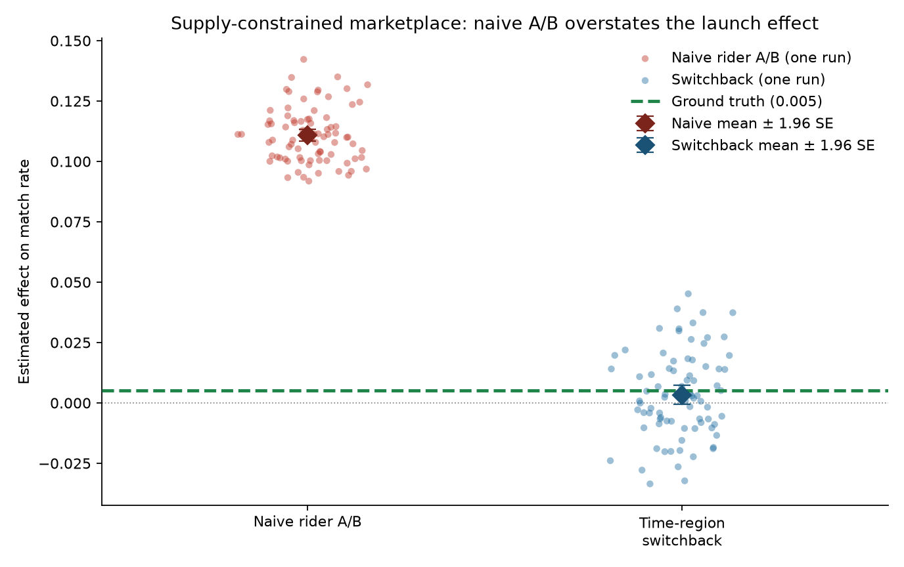
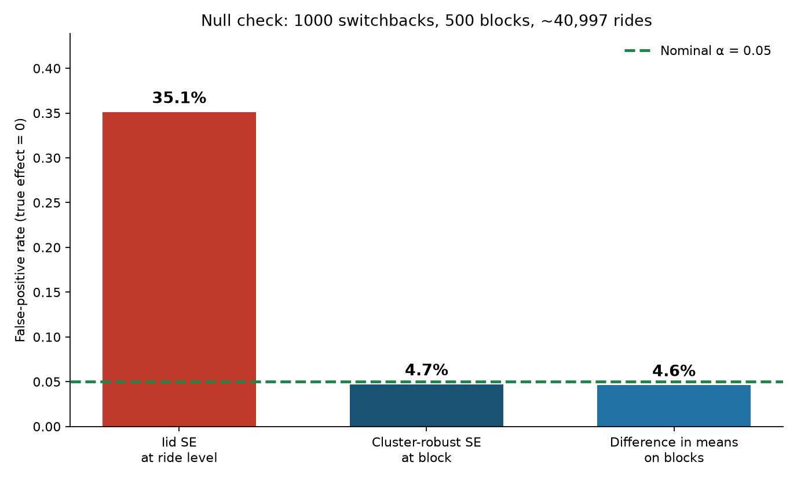
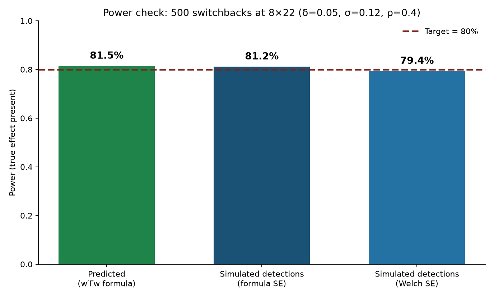

# SwitchbackExpToolkit

Normal A/B testing breaks in a rideshare or delivery marketplace, and this library is the set of tools that makes testing work there instead.

## The core idea, no jargon

Say you run an online store and want to know if a green button beats a blue one. Easy. Show green to half your visitors, blue to the other half, see who buys more. This works because what one shopper does has nothing to do with what another shopper does. Everyone's in their own bubble.

Now say you work at a rideshare platform and want to test a discount. Give it to half the riders. They start booking more.

But there are only so many drivers on the road tonight. Every ride a discount rider takes is a driver who isn't available for a non-discount rider. So the discount group gets more rides and the other group gets fewer. Your test shows a big win.

Except no new rides were created. The rides just moved from one group to the other. It's like splitting a pizza: giving one person a bigger slice doesn't make more pizza.

You launch the discount to everyone expecting +11%. You get +0.5%. The test measured who won a fight over a fixed supply of drivers, not whether the discount actually grows the business.

## The second problem, which is sneakier

Even setting aside the wrong number, the test is also far too confident about it.

Imagine polling a city. Ask 500 different people and you've got 500 real opinions. Ask 500 people who are all in the same room agreeing with each other, and you've really only got a few opinions, repeated.

Rides work the same way. Every ride in Brooklyn at 3pm is competing for the same drivers that hour. If drivers are scarce, everyone in that hour has a bad time together. Those rides aren't roughly 80 separate pieces of evidence; they're one hour's worth.

Standard tools don't know this. They count every ride as independent evidence, so a night of rides looks like a mountain of data. More data points make an answer look more certain, so the tool becomes wildly overconfident.

## The fix

Stop splitting riders. Split time and place instead.

Turn the feature on for all of Brooklyn from 2 to 3pm. Off from 3 to 4. On from 4 to 5. Do that across many neighborhoods and many hours. Now everyone in a given hour is under the same policy, so nobody's stealing drivers from a control group. This is called a switchback experiment.

Then count your evidence in city-hours (about 500 of them), not rides (about 41,000).

The catch: leftover drivers can still serve a neighboring region. A discount in Brooklyn at 3pm pulls cars out of Queens, and Queens looks worse even though it was "control." Production switchbacks use large, well-separated zones, not adjacent city blocks.

The library models that leak (`driver_leakage`). To estimate without the border, put adjacent regions on one sequence (`cluster_size`) so an interior exists, then drop cells that touch the other arm (`spatial_buffer`). Those interiors are what `analysis_table` keeps, same idea as a temporal washout.

## How I know it works

I built a fake marketplace where I set the true answer myself, then ran each method against it. The tables below have the exact figures. In English, here is what I checked:

**The right number.** Truth was +0.5%. The old method said +11%, off by twenty times. The new method said +0.5%, dead on.

**Quiet when nothing is happening.** I ran an experiment where the feature did literally nothing, a thousand times. A good test should be fooled by random noise about 5 times in 100. The old method was fooled 35 times in 100. The new one, 4.7. So a third of the old method's "wins" would have been pure noise.

**It notices when something *is* happening.** The library predicted it would detect a real effect 80% of the time at a given size. I ran it 500 times at that size. It detected 81%. Prediction and reality matched.

**The error bars are honest.** Every result comes with a range, like "+2%, give or take 1%." That range is supposed to contain the true answer 95% of the time. The new method: 96%. The old method: 0%. Not "rarely" — never, in 500 tries. Its range was tight and centered on the wrong number every single time.

**Drivers leaking across a border.** When leftover cars can serve the next region, an unbuffered switchback said +0.29; truth was +0.25. Sealed zones and a spatial buffer both landed near truth. The buffer kept 66% of cells at cluster size 3. Cluster size 1 kept 26%.

## The honest tradeoff

The new method is noisier. Any single experiment can be off by a couple of points in either direction, where the old method lands in the same spot every time. But it lands in the wrong spot every time.

A fuzzy answer near the truth is useful. A sharp answer far from the truth is worse than useless, because the sharpness makes you believe it.

## Under the hood

[Sample-size planning](https://doi.org/10.1287/mnsc.2022.4583), [CUPED](https://doi.org/10.1145/2487575.2487651) for variance reduction, [alpha spending](https://doi.org/10.1093/biomet/70.3.659) for safe peeking, and the [interference diagnostic](#marketplace-interference). Each is cited below.

**References.** Marketplace interference: [Blake & Coey (2014)](https://doi.org/10.1145/2566486.2567967); causal effects when people affect each other: [Hudgens & Halloran (2008)](https://doi.org/10.1198/016214508000000292). Switchback design and analysis: [Bojinov, Simchi-Levi & Zhao (2023)](https://doi.org/10.1287/mnsc.2022.4583). CUPED: [Deng, Xu, Kohavi & Walker (2013)](https://doi.org/10.1145/2487575.2487651). Sequential testing: [Lan & DeMets (1983)](https://doi.org/10.1093/biomet/70.3.659). When to cluster: [Abadie, Athey, Imbens & Wooldridge (2023)](https://doi.org/10.1093/qje/qjac038).

## The chart

Five hundred simulated launches of a demand-side treatment in a **supply-constrained** market. Ground truth is the difference in match rate between an all-treat world and an all-control world. Every estimate ships a 95% interval; coverage is how often that interval actually contains the truth.



| Estimator | Mean | Bias | RMSE | 95% coverage |
| --- | ---: | ---: | ---: | ---: |
| Naive rider A/B | **+0.112** | **+0.107** | **0.107** | **0%** |
| Time-region switchback | **+0.005** | **+0.000** | **0.017** | **96%** |
| Ground truth | **+0.005** | — | — | — |

Naive A/B is precise and wrong: treated riders crowd out control riders for the same drivers, so the within-cell gap looks like an 11pp win. Its intervals are tight around that wrong number, so they almost never contain the launch effect.

That's the whole argument. The rest of the README is how to compute it.

## Proof the test is calibrated (true effect = 0)

A thousand independent switchbacks of a **null** policy: treated and control riders request at the same rate, no extra drivers. There is nothing to detect. A 5% test should light up about fifty times.

Each run randomizes **500** time-region blocks and records ~**41,000** rides. If you feed the rides to an iid t-test, the SE thinks those are 41,000 independent experiments. They are not. Treatment was assigned to the block.



| Estimator | n used in the SE | Reject H₀ (α = 0.05) |
| --- | ---: | ---: |
| iid SE at ride level | 40,997 rides | **35.1%** |
| Cluster-robust SE at the block | 500 blocks | **4.7%** |
| Difference in means on blocks | 500 blocks | **4.6%** |

35% false positives is the usual mistake when experimentation tooling is ported from a normal product context to a marketplace: you analyze at the individual-ride level after you randomized at the block. Cluster at the randomization unit, or aggregate to one row per block. Both land on the nominal 5%.

```bash
python -m sbetoolkit.cli --mode null --reps 1000 --seed 11
```

```python
from sbetoolkit import type_i_null_check

result = type_i_null_check(n_reps=1000, seed=11)
print(result.summary())
# iid 35.1%   cluster 4.7%   block 4.6%
```

Raw rates: `docs/type_i_null.csv`.

## Proof the power formula is calibrated (true effect ≠ 0)

The Type I check asks whether you cry wolf too often. This one asks whether you miss a real wolf. `switchback_sample_size` said **8 regions × 22 periods** (176 blocks) for 80% power at δ = 0.05, σ = 0.12, ρ = 0.4. Five hundred simulated switchbacks at *exactly that size*, with that effect present:



| | Power |
| --- | ---: |
| Predicted (`w′Γw`) | **81.5%** |
| Detected (formula SE) | **81.2%** |
| Detected (Welch SE on analysis_table) | **79.4%** |
| Monte Carlo SD of ATE / formula SE | **0.98** |

If the variance formula were wrong you would see ~55% here: the test would be sized for a different experiment than the one you run. 81% vs 80% is the formula and the simulator agreeing.

```bash
python -m sbetoolkit.cli --mode power --reps 500 --seed 13
```

```python
from sbetoolkit import empirical_power_check, switchback_sample_size

needed = switchback_sample_size(0.05, 0.12, n_regions=8, rho_ar1=0.4, power=0.8)
print(needed.n_periods, needed.power)
print(empirical_power_check(n_reps=500, seed=13).summary())
```

Raw rates: `docs/empirical_power.csv`.

## Install

```bash
pip install -e ".[dev]"
python -m pytest
python -m sbetoolkit.cli --mode chart --out docs/naive_vs_switchback.png
python -m sbetoolkit.cli --mode null --reps 1000 --seed 11 --out docs/type_i_null.png
python -m sbetoolkit.cli --mode power --reps 500 --seed 13 --out docs/empirical_power.png
python -m sbetoolkit.cli --mode spillover --reps 200 --seed 3 --out docs/spatial_spillover.csv
```

## Marketplace interference

```python
from sbetoolkit import MarketplaceConfig, MarketplaceSimulator, diagnose_interference

sim = MarketplaceSimulator(MarketplaceConfig(
    n_regions=8, n_periods=24,
    riders_per_cell=40, drivers_per_cell=18,
    p_request_control=0.70, p_request_treat=0.90,
    seed=7,
))
print(sim.ground_truth())
print(diagnose_interference(sim).direction)
# → naive A/B overstates the global effect
```

The diagnostic splits the bias into **control crowding-out** (control match rate in a mixed market vs all-control) and **treated dilution** (treated match rate in a mixed market vs all-treat). Flip the story by setting `extra_drivers_if_treated > 0` with no demand lift: rider A/B never applies a cell-level supply incentive, so it **understates** the launch.

## Cross-region spillover

Default `driver_leakage=0`. Regions are sealed. That is the market behind every earlier table, so those numbers are unchanged.

Turn leakage on and leftover drivers in a control region serve unmatched demand next door. The treated cell looks better than it would under a full launch; the contrast is the pizza-slice problem one geography over.

I did not run this on the default saturated market. There every cell is already short of drivers, so there is nothing left to leak and all three columns would agree. This check uses slack control (idle cars) and tight treated (leftover demand): 6 regions × 16 periods, cluster size 3, 200 runs.

| Condition | Mean | Bias | Cells kept |
| --- | ---: | ---: | ---: |
| Sealed zones (`driver_leakage=0`) | **+0.236** | **−0.006** | **100%** |
| Leakage, no buffer | **+0.288** | **+0.036** | **100%** |
| Leakage, spatial buffer | **+0.243** | **−0.009** | **67%** |

Bias is versus that world's global ATE: sealed truth **+0.242**, leaky truth **+0.252**. Unbuffered leakage overstates the launch by about 3.6pp. The buffer lands on the leaky launch effect; it just throws away the border.

Those discarded cells are the price. Cluster size 1 is six independent sequences and a ring of T/C borders: the buffer keeps **26%** of the grid. Size 3 is two sequences and an interior: **66%** kept. Size 2 sits in between at **51%**. Same 96 cells, same one-hop buffer.

| Cluster size | Sequences to randomize | Cells kept after buffer |
| --- | ---: | ---: |
| 1 | 6 | **26%** |
| 2 | 3 | **51%** |
| 3 | 2 | **66%** |

Bigger clusters mean less contamination and more usable interior, but fewer independent units. It is the same tradeoff as block length, as a keep rate.

```bash
python -m sbetoolkit.cli --mode spillover --reps 200 --seed 3
```

```python
from sbetoolkit import (
    MarketplaceConfig,
    MarketplaceSimulator,
    diagnose_spatial_spillover,
    spatial_buffer_cost,
)

leaky = MarketplaceSimulator(MarketplaceConfig(
    n_regions=6, n_periods=16, drivers_per_cell=30,
    p_request_control=0.50, p_request_treat=0.95,
    driver_leakage=1.0, seed=3,
))
print(diagnose_spatial_spillover(leaky, n_reps=200, seed=3, cluster_size=3))
print(spatial_buffer_cost(n_regions=6, n_periods=16, cluster_sizes=(1, 2, 3), seed=3))
```

Raw rates: `docs/spatial_spillover.csv`, `docs/spatial_spillover_keep.csv`.

## Switchback randomization

```python
from sbetoolkit import assign_switchback, estimate_switchback

design = assign_switchback(
    regions=["sf", "nyc", "chi", "aus"],
    periods=range(28),
    design="balanced",   # or independent, blocked_random
    washout=1,           # drop re-equilibration periods after each switch
    cluster_size=2,      # neighbors share a sequence (ring order)
    spatial_buffer=1,    # drop cells that border the opposite arm
    seed=0,
)
design.analysis_table  # estimation sample; washout and spatial-buffer rows are gone
estimate_switchback(design, outcomes)  # joins on analysis_table, not table
```

Blocks are `(region, period)`. Region order is geography: neighbors sit next to each other on a ring. `design.table` is the full calendar (needed to simulate the world, including re-equilibration and driver leakage). Every estimator goes through `design.analysis_table`. Poison the washout or buffer rows and the ATE does not move.

## Power / sample size

Variance of the switchback contrast is `w'Γw` with AR(1) outcomes, not the iid two-sample formula. Positive serial correlation **inflates** variance for long treated/control runs and **shrinks** it for alternating switches (neighbor pairing).

```python
from sbetoolkit import switchback_power, switchback_sample_size

needed = switchback_sample_size(
    delta=0.02, sigma=0.08, n_regions=8,
    rho_ar1=0.4, washout=1, power=0.8,
)
print(needed.n_periods, needed.power, needed.se)

print(switchback_power(0.02, 0.08, n_regions=8, n_periods=28, rho_ar1=0.4))
```

## CUPED

```python
from sbetoolkit.cuped import cuped_theta, difference_in_means

fit = cuped_theta(y, x_pre)          # θ = Cov(Y,X)/Var(X)
est = difference_in_means(y, treat, x=x_pre)
print(fit.variance_reduction, est["ate"], est["se"])
```

Fit `θ` on a locked pre-period if you will peek sequentially. Do not use the previous *experimental* period as `X` — that is post-treatment.

## Sequential tests (Lan–DeMets)

Boundaries solve the Brownian-motion crossing probabilities so total Type I error is `α`, not `α × n_looks`.

```python
from sbetoolkit import SequentialMonitor, spending_boundaries

spending_boundaries([0.25, 0.5, 0.75, 1.0], family="obrien_fleming")
# first look is strict; last look is near the usual 1.96

mon = SequentialMonitor(alpha=0.05, family="obrien_fleming",
                        planned_info=[0.5, 1.0])
mon.update(z=1.1, info_fraction=0.5)   # does not reject
mon.update(z=2.3, info_fraction=1.0)
```

Families: `obrien_fleming`, `pocock`, `kim_deMets` (power spending `α t^ρ`).

## Reproduce the chart

```python
from sbetoolkit import MarketplaceConfig, MarketplaceSimulator, summarize_estimators
from sbetoolkit.plots import plot_naive_vs_switchback

sim = MarketplaceSimulator(MarketplaceConfig(seed=7))
df = sim.compare_estimators(n_reps=500, seed=7)
print(summarize_estimators(df))
plot_naive_vs_switchback(df, path="docs/naive_vs_switchback.png")
```

`compare_estimators` draws naive rider splits and switchback assignments on the same class of market primitives and compares both to a Monte Carlo global ATE. Coverage is the share of 95% intervals that contain that ATE.
